# Linux Helpdesk Troubleshooting Lab — Logbook

## 2026-06-29 — Part 1: Repository setup

### Goal

Start the Linux Helpdesk Troubleshooting Lab by creating the local project structure, initial documentation files and project folders.

### Work completed

* Created the local project folder.
* Created the main documentation folders:

  * docs
  * screenshots
  * scripts
  * results
* Created `README.md`.
* Created `logbook.md`.
* Created `.gitkeep` files so Git can track empty folders.
* Opened the project in VS Code.
* Saved screenshot evidence.

### Project structure

```text
Linux-Helpdesk-Troubleshooting-Lab/
├── docs/
│   └── .gitkeep
├── results/
│   └── .gitkeep
├── screenshots/
│   └── .gitkeep
├── scripts/
│   └── .gitkeep
├── logbook.md
└── README.md
```

### Commands used

```powershell
cd C:\Users\*****
mkdir Linux-Helpdesk-Troubleshooting-Lab
cd Linux-Helpdesk-Troubleshooting-Lab

mkdir docs
mkdir screenshots
mkdir scripts
mkdir results

New-Item README.md
New-Item logbook.md

New-Item docs\.gitkeep
New-Item screenshots\.gitkeep
New-Item scripts\.gitkeep
New-Item results\.gitkeep

code .
```

### Command purpose

| Command                                    | Purpose                                                |
| ------------------------------------------ | ------------------------------------------------------ |
| `cd C:\Users\*****`                        | Moves PowerShell to the user folder.                   |
| `mkdir Linux-Helpdesk-Troubleshooting-Lab` | Creates the main project folder.                       |
| `cd Linux-Helpdesk-Troubleshooting-Lab`    | Moves into the project folder.                         |
| `mkdir docs`                               | Creates the documentation folder.                      |
| `mkdir screenshots`                        | Creates the screenshot evidence folder.                |
| `mkdir scripts`                            | Creates the script storage folder.                     |
| `mkdir results`                            | Creates the command output and result storage folder.  |
| `New-Item README.md`                       | Creates the main README file.                          |
| `New-Item logbook.md`                      | Creates the project logbook file.                      |
| `New-Item .gitkeep`                        | Creates placeholder files so Git tracks empty folders. |
| `code .`                                   | Opens the current project folder in VS Code.           |

### Notes

This part creates the documentation base for the Linux Helpdesk Troubleshooting Lab.

The project will continue with a Linux baseline check before users, groups, permissions or troubleshooting scenarios are created.

Only safe lab data should be used in this project. No real secrets, credentials, private files or production data should be included.

### Evidence

Screenshot:

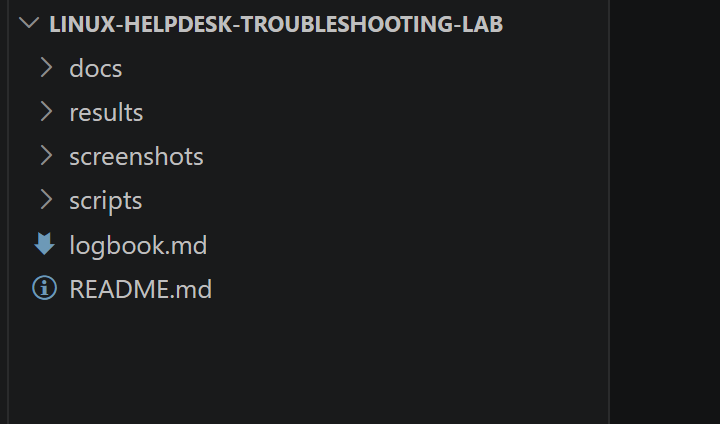

---

## 2026-06-29 — Part 2: Linux baseline check

### Goal

Review the Linux system baseline before creating helpdesk troubleshooting scenarios.

### Work completed

* Reviewed hostname and system information.
* Verified the current logged-in user.
* Reviewed user ID and group membership information.
* Reviewed the Linux operating system version.
* Reviewed the kernel version.
* Reviewed current date and uptime.
* Reviewed disk usage.
* Reviewed memory and swap usage.
* Reviewed IP address and network interface information.
* Reviewed routing information.
* Checked SSH service status.
* Checked firewalld service status.
* Saved screenshot evidence.

### Verification results

| Item                | Result                          |
| ------------------- | ------------------------------- |
| System identity     | Reviewed with `hostnamectl`     |
| Current user        | Reviewed with `whoami`          |
| User and groups     | Reviewed with `id`              |
| OS version          | Reviewed with `/etc/os-release` |
| Kernel version      | Reviewed with `uname -r`        |
| Date and uptime     | Reviewed                        |
| Disk usage          | Reviewed with `df -h`           |
| Memory usage        | Reviewed with `free -h`         |
| Network interfaces  | Reviewed with `ip addr`         |
| Routing information | Reviewed with `ip route`        |
| SSH service         | Reviewed with `systemctl`       |
| Firewall service    | Reviewed with `systemctl`       |

### Commands used

```bash
hostnamectl
whoami
id
cat /etc/os-release
uname -r
date
uptime

df -h
free -h

ip addr
ip route

systemctl status sshd --no-pager
systemctl status firewalld --no-pager
```

### Command purpose

| Command                                 | Purpose                                                    |
| --------------------------------------- | ---------------------------------------------------------- |
| `hostnamectl`                           | Shows hostname, operating system, kernel and architecture. |
| `whoami`                                | Shows the current logged-in user.                          |
| `id`                                    | Shows user ID, group ID and group memberships.             |
| `cat /etc/os-release`                   | Shows the Linux distribution and version.                  |
| `uname -r`                              | Shows the running kernel version.                          |
| `date`                                  | Shows the current system date and time.                    |
| `uptime`                                | Shows how long the system has been running.                |
| `df -h`                                 | Shows disk usage in human-readable format.                 |
| `free -h`                               | Shows memory and swap usage in human-readable format.      |
| `ip addr`                               | Shows network interfaces and IP addresses.                 |
| `ip route`                              | Shows routing information and the default route.           |
| `systemctl status sshd --no-pager`      | Checks whether the SSH service is running.                 |
| `systemctl status firewalld --no-pager` | Checks whether the firewall service is running.            |

### Notes

This baseline check gives the project a clear starting point before helpdesk troubleshooting tasks are created.

The commands used in this part are common beginner Linux support commands and are useful for helpdesk, junior sysadmin and troubleshooting work.

### Evidence

Screenshots:

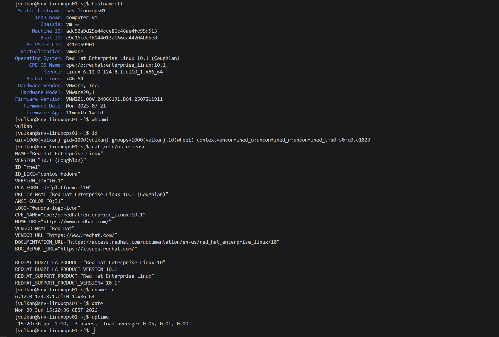

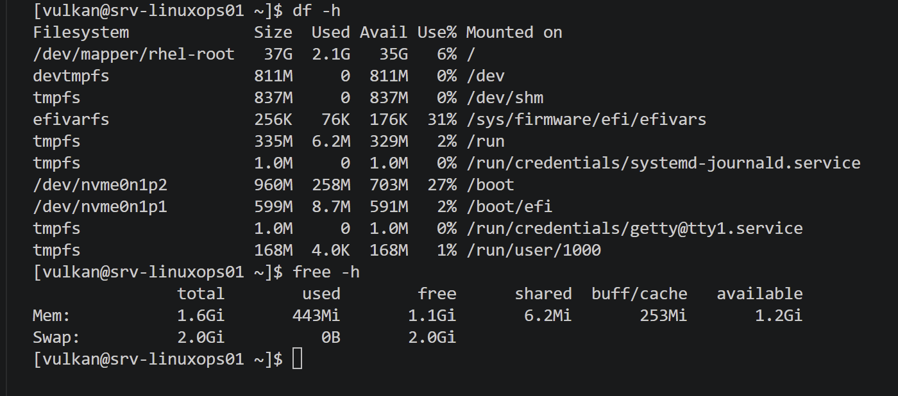

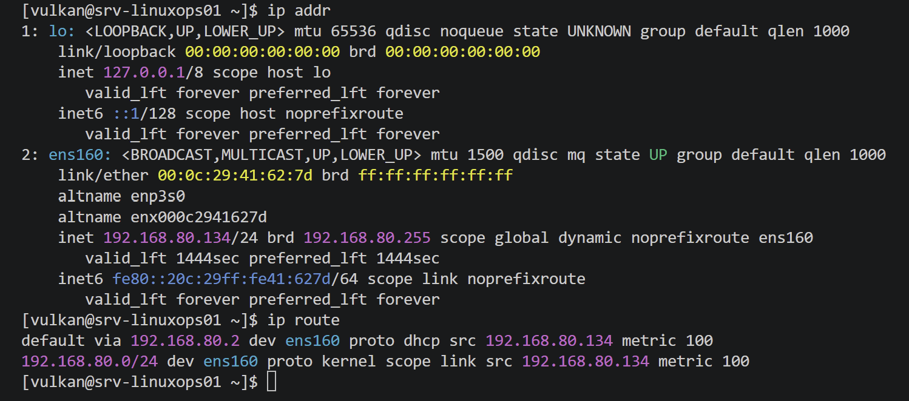

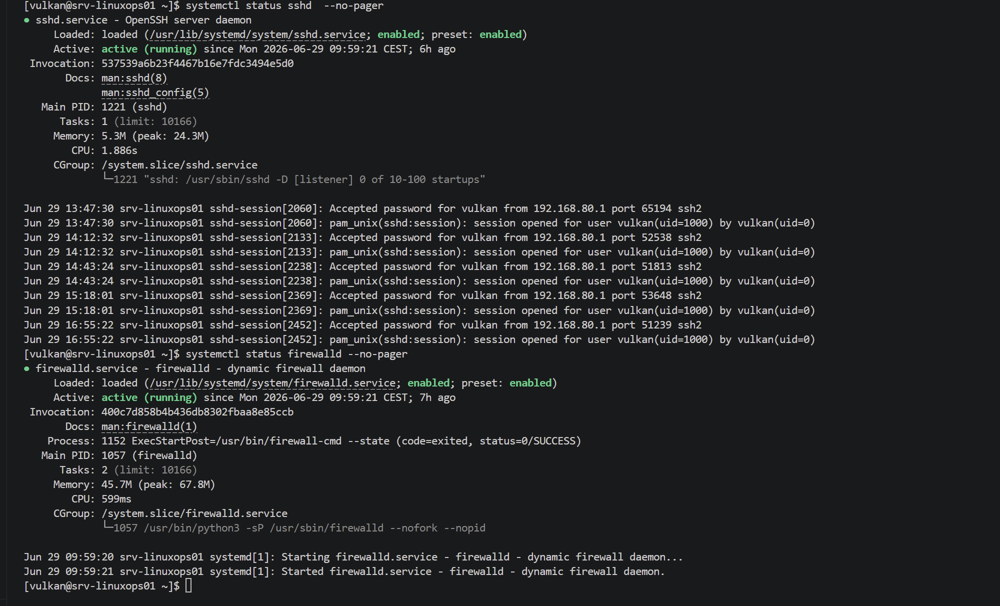

---

## 2026-06-29 — Part 3: Create test users and groups

### Goal

Create safe lab users and groups for future helpdesk troubleshooting and permission testing.

### Work completed

* Created the `support` group.
* Created the `staff` group.
* Created the `alice` test user.
* Created the `bob` test user.
* Created home folders for both users.
* Added `alice` to the `support` group.
* Added `bob` to the `staff` group.
* Set lab passwords for both users.
* Verified user IDs and group memberships.
* Verified user database entries.
* Verified group database entries.
* Verified home folder ownership and permissions.
* Saved screenshot evidence.

### Verification results

| Item                   | Result        |
| ---------------------- | ------------- |
| Support group          | Created       |
| Staff group            | Created       |
| User `alice`           | Created       |
| User `bob`             | Created       |
| Alice group membership | `support`     |
| Bob group membership   | `staff`       |
| Alice home folder      | `/home/alice` |
| Bob home folder        | `/home/bob`   |

### Commands used

```bash
sudo groupadd support
sudo groupadd staff

sudo useradd -m -G support alice
sudo useradd -m -G staff bob

sudo passwd alice
sudo passwd bob

id alice
id bob

getent passwd alice
getent passwd bob

getent group support
getent group staff

ls -ld /home/alice
ls -ld /home/bob
```

### Command purpose

| Command                            | Purpose                                                           |
| ---------------------------------- | ----------------------------------------------------------------- |
| `sudo groupadd support`            | Creates the `support` group.                                      |
| `sudo groupadd staff`              | Creates the `staff` group.                                        |
| `sudo useradd -m -G support alice` | Creates `alice`, creates her home folder and adds her to support. |
| `sudo useradd -m -G staff bob`     | Creates `bob`, creates his home folder and adds him to staff.     |
| `sudo passwd alice`                | Sets a lab password for `alice`.                                  |
| `sudo passwd bob`                  | Sets a lab password for `bob`.                                    |
| `id alice`                         | Shows Alice’s user ID and group memberships.                      |
| `id bob`                           | Shows Bob’s user ID and group memberships.                        |
| `getent passwd alice`              | Shows Alice’s user database entry.                                |
| `getent passwd bob`                | Shows Bob’s user database entry.                                  |
| `getent group support`             | Shows the `support` group entry and members.                      |
| `getent group staff`               | Shows the `staff` group entry and members.                        |
| `ls -ld /home/alice`               | Shows Alice’s home folder ownership and permissions.              |
| `ls -ld /home/bob`                 | Shows Bob’s home folder ownership and permissions.                |

### Notes

The test users and groups are safe lab accounts used only for helpdesk troubleshooting practice.

This part prepares the lab for future permission and folder access scenarios.

The user `bob` should be lowercase. Linux usernames are case-sensitive, so `bob` and `Bob` are different accounts.

### Evidence

Screenshots:

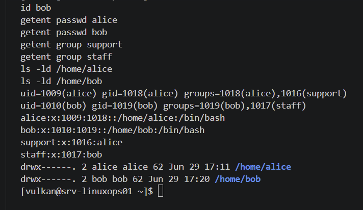


---

## 2026-06-30 — Part 4: Create shared support folders

### Goal

Create shared folders for the `support` and `staff` groups and verify basic group-based access control.

### Work completed

* Created `/shared/support`.
* Created `/shared/staff`.
* Set group ownership for the shared folders.
* Set folder permissions for group-based access.
* Created a support test file.
* Created a staff test file.
* Set group ownership for the test files.
* Set file permissions for the test files.
* Verified shared folder ownership.
* Verified shared folder permissions.
* Tested correct access for `alice`.
* Tested correct access for `bob`.
* Tested blocked access for users outside the correct group.
* Saved screenshot evidence.

### Verification results

| Item                           | Result            |
| ------------------------------ | ----------------- |
| Support shared folder          | `/shared/support` |
| Staff shared folder            | `/shared/staff`   |
| Support folder owner/group     | `root:support`    |
| Staff folder owner/group       | `root:staff`      |
| Folder permissions             | `770`             |
| File permissions               | `660`             |
| Alice access to support folder | Allowed           |
| Bob access to staff folder     | Allowed           |
| Alice access to staff folder   | Denied            |
| Bob access to support folder   | Denied            |

### Commands used

```bash
sudo mkdir -p /shared/support
sudo mkdir -p /shared/staff

sudo chown root:support /shared/support
sudo chown root:staff /shared/staff

sudo chmod 770 /shared/support
sudo chmod 770 /shared/staff

echo "Support team shared folder" | sudo tee /shared/support/support-notes.txt
echo "Staff shared folder" | sudo tee /shared/staff/staff-notes.txt

sudo chown root:support /shared/support/support-notes.txt
sudo chown root:staff /shared/staff/staff-notes.txt

sudo chmod 660 /shared/support/support-notes.txt
sudo chmod 660 /shared/staff/staff-notes.txt

ls -ld /shared
ls -ld /shared/support
ls -ld /shared/staff

sudo ls -l /shared/support
sudo ls -l /shared/staff

sudo -u alice ls -l /shared/support
sudo -u alice cat /shared/support/support-notes.txt

sudo -u bob ls -l /shared/staff
sudo -u bob cat /shared/staff/staff-notes.txt

sudo -u alice ls -l /shared/staff
sudo -u bob ls -l /shared/support
```

### Command purpose

| Command                                                                           | Purpose                                                          |
| --------------------------------------------------------------------------------- | ---------------------------------------------------------------- |
| `sudo mkdir -p /shared/support`                                                   | Creates the support shared folder.                               |
| `sudo mkdir -p /shared/staff`                                                     | Creates the staff shared folder.                                 |
| `sudo chown root:support /shared/support`                                         | Sets the support folder owner to `root` and group to `support`.  |
| `sudo chown root:staff /shared/staff`                                             | Sets the staff folder owner to `root` and group to `staff`.      |
| `sudo chmod 770 /shared/support`                                                  | Allows owner and group full folder access while blocking others. |
| `sudo chmod 770 /shared/staff`                                                    | Allows owner and group full folder access while blocking others. |
| `echo "Support team shared folder" \| sudo tee /shared/support/support-notes.txt` | Creates the support test file.                                   |
| `echo "Staff shared folder" \| sudo tee /shared/staff/staff-notes.txt`            | Creates the staff test file.                                     |
| `sudo chown root:support /shared/support/support-notes.txt`                       | Sets the support test file group ownership.                      |
| `sudo chown root:staff /shared/staff/staff-notes.txt`                             | Sets the staff test file group ownership.                        |
| `sudo chmod 660 /shared/support/support-notes.txt`                                | Allows owner and group read/write access to the support file.    |
| `sudo chmod 660 /shared/staff/staff-notes.txt`                                    | Allows owner and group read/write access to the staff file.      |
| `ls -ld /shared`                                                                  | Shows the main shared folder permissions and ownership.          |
| `ls -ld /shared/support`                                                          | Shows support folder permissions and ownership.                  |
| `ls -ld /shared/staff`                                                            | Shows staff folder permissions and ownership.                    |
| `sudo ls -l /shared/support`                                                      | Lists the support folder contents as an administrator.           |
| `sudo ls -l /shared/staff`                                                        | Lists the staff folder contents as an administrator.             |
| `sudo -u alice ls -l /shared/support`                                             | Tests whether Alice can access the support folder.               |
| `sudo -u alice cat /shared/support/support-notes.txt`                             | Tests whether Alice can read the support test file.              |
| `sudo -u bob ls -l /shared/staff`                                                 | Tests whether Bob can access the staff folder.                   |
| `sudo -u bob cat /shared/staff/staff-notes.txt`                                   | Tests whether Bob can read the staff test file.                  |
| `sudo -u alice ls -l /shared/staff`                                               | Confirms Alice is blocked from the staff folder.                 |
| `sudo -u bob ls -l /shared/support`                                               | Confirms Bob is blocked from the support folder.                 |

### Notes

This part demonstrates basic Linux access control using users, groups, ownership and permissions.

The `support` group can access the support folder, and the `staff` group can access the staff folder.

Users outside the correct group are denied access, which confirms that group-based folder separation works.

This prepares the lab for the next part, where a permission problem will be created and fixed.

### Evidence

Screenshots:

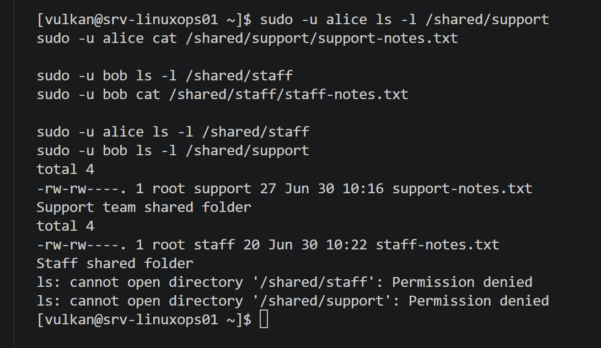

---

## 2026-06-30 — Part 5: Fix permission problem

### Goal

Create a basic Linux permission problem, investigate why a user cannot access a file and fix the issue.

### Work completed

* Created a permission problem on `/shared/support/support-notes.txt`.
* Changed the file permission to `600`.
* Verified that `alice` could not read the support file.
* Investigated Alice’s user and group membership.
* Verified that Alice belonged to the `support` group.
* Reviewed the `/shared/support` folder permissions.
* Reviewed the support file permissions.
* Identified the file permission as the cause of the access problem.
* Restored the file permission to `660`.
* Verified that `alice` could read the support file again.
* Verified that `bob` was still denied access to the support file.
* Saved screenshot evidence.

### Verification results

| Item                        | Result                               |
| --------------------------- | ------------------------------------ |
| Affected file               | `/shared/support/support-notes.txt`  |
| Broken permission           | `600`                                |
| Expected fixed permission   | `660`                                |
| Alice group membership      | `support`                            |
| Alice access during problem | Denied                               |
| Alice access after fix      | Allowed                              |
| Bob access after fix        | Denied                               |
| Cause of issue              | File permission removed group access |

### Commands used

```bash
sudo chmod 600 /shared/support/support-notes.txt
sudo ls -l /shared/support/support-notes.txt

sudo -u alice cat /shared/support/support-notes.txt

id alice
getent group support
ls -ld /shared/support
sudo ls -l /shared/support/support-notes.txt

sudo chmod 660 /shared/support/support-notes.txt
sudo ls -l /shared/support/support-notes.txt

sudo -u alice cat /shared/support/support-notes.txt
sudo -u bob cat /shared/support/support-notes.txt
```

### Command purpose

| Command                                               | Purpose                                                                                    |
| ----------------------------------------------------- | ------------------------------------------------------------------------------------------ |
| `sudo chmod 600 /shared/support/support-notes.txt`    | Creates the permission problem by allowing only the file owner to read and write the file. |
| `sudo ls -l /shared/support/support-notes.txt`        | Shows the file permission while using administrator privileges.                            |
| `sudo -u alice cat /shared/support/support-notes.txt` | Tests whether Alice can read the support file.                                             |
| `id alice`                                            | Shows Alice’s user ID and group memberships.                                               |
| `getent group support`                                | Confirms that Alice belongs to the `support` group.                                        |
| `ls -ld /shared/support`                              | Shows the support folder ownership and permissions.                                        |
| `sudo chmod 660 /shared/support/support-notes.txt`    | Fixes the permission by restoring owner and group read/write access.                       |
| `sudo -u alice cat /shared/support/support-notes.txt` | Verifies that Alice can read the file after the fix.                                       |
| `sudo -u bob cat /shared/support/support-notes.txt`   | Confirms Bob is still denied access to the support file.                                   |

### Notes

This part demonstrates a realistic helpdesk troubleshooting process.

The access problem was not caused by Alice’s account or group membership. Alice was correctly added to the `support` group.

The problem was caused by the file permission `600`, which removed group access from the file.

Changing the file permission back to `660` restored access for the support group while keeping users outside the group denied.

### Evidence

Screenshots:

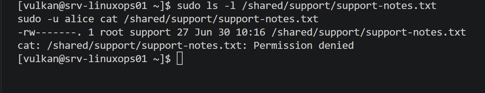

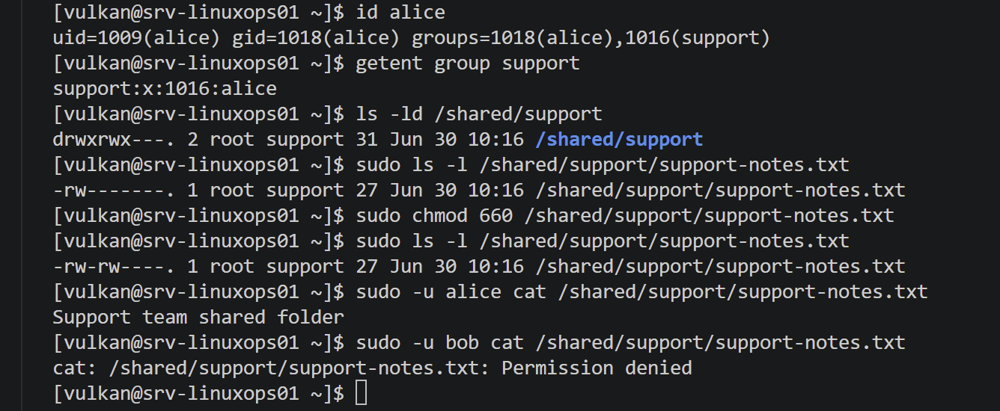


---

## 2026-06-30 — Part 6: Troubleshoot stopped service

### Goal

Create a basic stopped-service troubleshooting scenario, identify the service state, restore the service and review recent logs.

### Work completed

* Checked the initial `firewalld` service status.
* Stopped the `firewalld` service.
* Verified that the service was inactive.
* Started the `firewalld` service again.
* Verified that the service was active and running.
* Reviewed recent service logs.
* Saved screenshot evidence.

### Verification results

| Item                   | Result                                     |
| ---------------------- | ------------------------------------------ |
| Service tested         | `firewalld`                                |
| Service status command | `systemctl status firewalld --no-pager`    |
| Broken state           | Service stopped                            |
| Stopped service status | Inactive                                   |
| Fix command            | `sudo systemctl start firewalld`           |
| Fixed service status   | Active and running                         |
| Log review command     | `journalctl -u firewalld -n 20 --no-pager` |

### Commands used

```bash
systemctl status firewalld --no-pager

sudo systemctl stop firewalld
systemctl status firewalld --no-pager

sudo systemctl start firewalld
systemctl status firewalld --no-pager

journalctl -u firewalld -n 20 --no-pager
```

### Command purpose

| Command                                    | Purpose                                                            |
| ------------------------------------------ | ------------------------------------------------------------------ |
| `systemctl status firewalld --no-pager`    | Checks whether the firewall service is active or inactive.         |
| `sudo systemctl stop firewalld`            | Stops the firewall service to create the troubleshooting scenario. |
| `sudo systemctl start firewalld`           | Starts the firewall service again.                                 |
| `journalctl -u firewalld -n 20 --no-pager` | Shows the last 20 log entries for the firewall service.            |

### Notes

This part demonstrates basic service troubleshooting with `systemctl`.

The service was intentionally stopped to create a safe troubleshooting scenario.

After the stopped state was confirmed, the service was started again and verified as active.

Recent logs were reviewed with `journalctl` to confirm service activity.

`firewalld` was used instead of `sshd` because stopping `sshd` can break the SSH connection used by VS Code.

### Evidence

Screenshots:

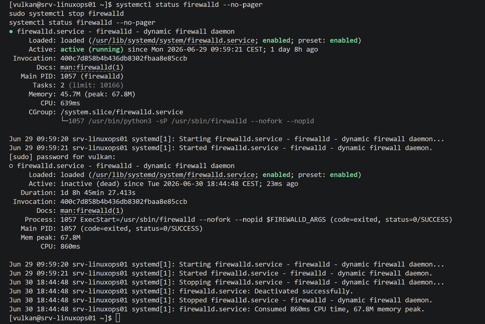

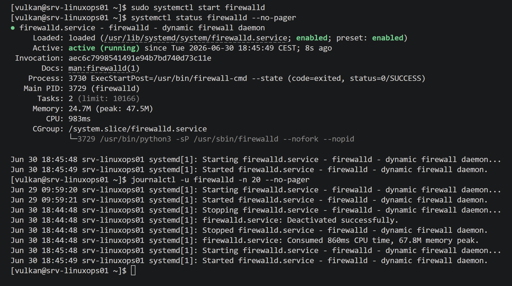

---

## 2026-06-30 — Part 7: Review logs

### Goal

Review recent Linux system logs, warning and error logs, SSH-related logs and service-specific logs.

### Work completed

* Reviewed recent system log entries.
* Reviewed warning and error log entries.
* Reviewed SSH authentication and session-related log entries.
* Reviewed `firewalld` service-specific logs.
* Practiced filtering logs with `journalctl`.
* Saved screenshot evidence.

### Verification results

| Item                    | Result         |
| ----------------------- | -------------- |
| Recent system logs      | Reviewed       |
| Warning and error logs  | Reviewed       |
| SSH authentication logs | Reviewed       |
| Firewalld service logs  | Reviewed       |
| Log tool used           | `journalctl`   |
| Priority filter used    | `-p warning`   |
| Service filter used     | `-u firewalld` |
| Command filter used     | `_COMM=sshd`   |

### Commands used

```bash
journalctl -n 30 --no-pager

journalctl -p warning -n 30 --no-pager

sudo journalctl _COMM=sshd -n 30 --no-pager

journalctl -u firewalld -n 30 --no-pager
```

### Command purpose

| Command                                       | Purpose                                                     |
| --------------------------------------------- | ----------------------------------------------------------- |
| `journalctl -n 30 --no-pager`                 | Shows the latest 30 system log entries.                     |
| `journalctl -p warning -n 30 --no-pager`      | Shows recent warning-level and higher-priority log entries. |
| `sudo journalctl _COMM=sshd -n 30 --no-pager` | Shows recent SSH daemon log entries.                        |
| `journalctl -u firewalld -n 30 --no-pager`    | Shows recent `firewalld` service log entries.               |

### Notes

This part demonstrates basic Linux log review.

The recent system logs were reviewed to understand current system activity.

Warning and error logs were reviewed to identify possible issues that may need attention.

SSH-related logs were reviewed because SSH is commonly used for remote administration and helpdesk troubleshooting.

`firewalld` logs were reviewed as a service-specific example because `firewalld` was used in the previous stopped-service troubleshooting part.

### Evidence

Screenshots:

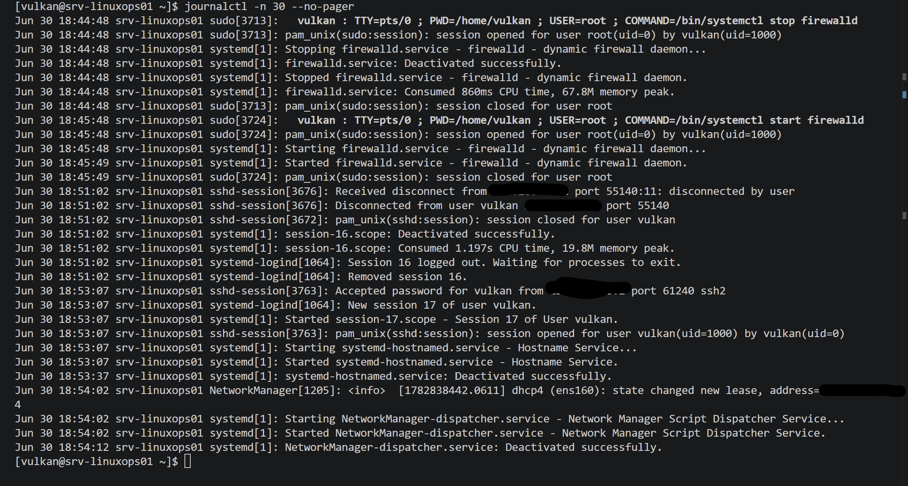

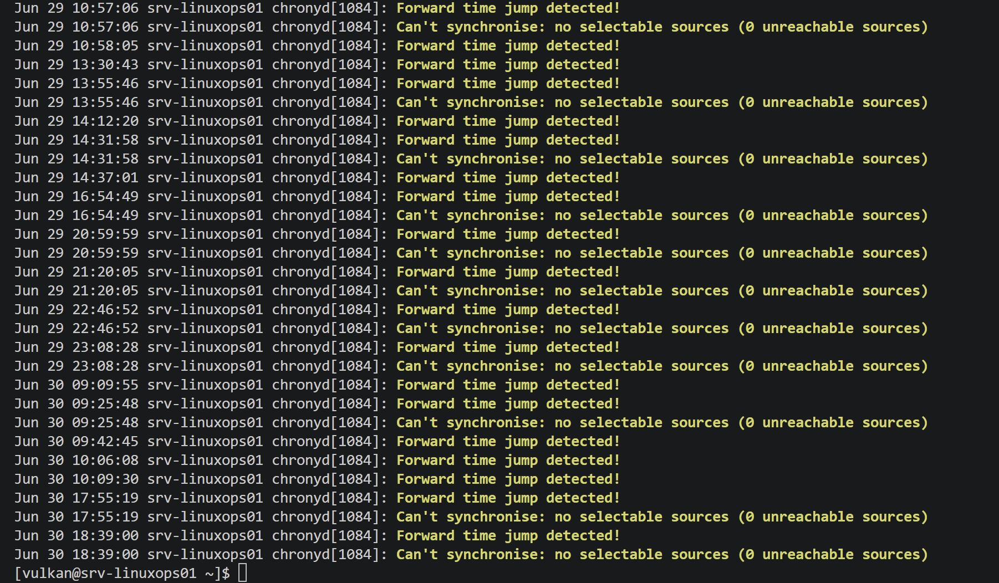

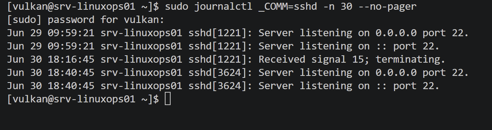

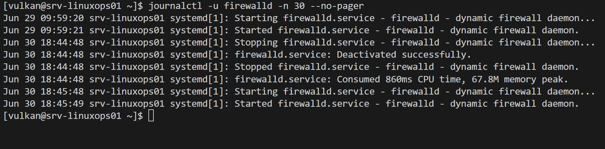

---

## 2026-06-30 — Part 8: Check disk and system resources

### Goal

Review basic Linux disk usage, memory usage, uptime, logged-in users and CPU process activity.

### Work completed

* Reviewed mounted filesystem disk usage.
* Reviewed memory usage.
* Reviewed swap usage.
* Reviewed system uptime.
* Reviewed system load average.
* Reviewed currently logged-in users.
* Reviewed top CPU-consuming processes.
* Saved screenshot evidence.

### Verification results

| Item              | Result   |
| ----------------- | -------- |
| Disk usage        | Reviewed |
| Memory usage      | Reviewed |
| Swap usage        | Reviewed |
| Uptime            | Reviewed |
| Load average      | Reviewed |
| Logged-in users   | Reviewed |
| Top CPU processes | Reviewed |

### Commands used

```bash
df -h

free -h

uptime
who

ps aux --sort=-%cpu | head -10
```

### Command purpose

| Command                           | Purpose                                                                 |
| --------------------------------- | ----------------------------------------------------------------------- |
| `df -h`                           | Shows mounted filesystems and disk usage in human-readable format.      |
| `free -h`                         | Shows memory and swap usage in human-readable format.                   |
| `uptime`                          | Shows how long the system has been running and the system load average. |
| `who`                             | Shows currently logged-in users.                                        |
| `ps aux --sort=-%cpu \| head -10` | Shows the top CPU-consuming processes.                                  |

### Notes

This part demonstrates basic Linux resource checking.

Disk usage was reviewed to confirm available storage space.

Memory and swap usage were reviewed to check current resource usage.

Uptime and load average were reviewed to understand how long the system had been running and whether the system appeared heavily loaded.

Logged-in users were reviewed to see active sessions.

Top CPU-consuming processes were reviewed to identify whether any process was using high CPU.

### Evidence

Screenshots:

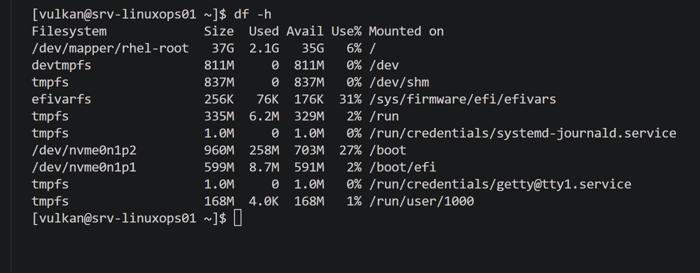

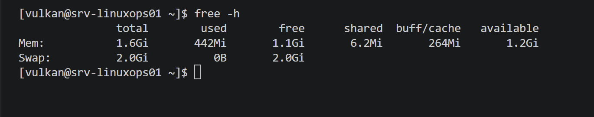

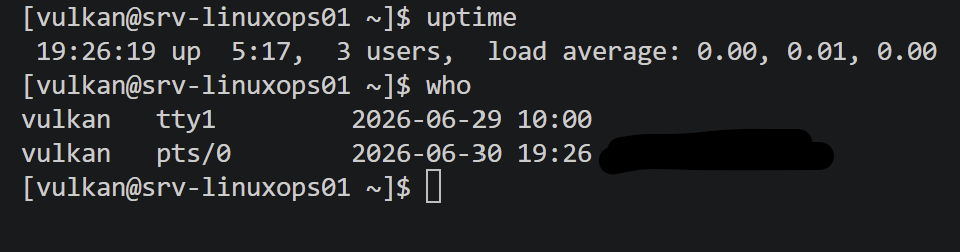

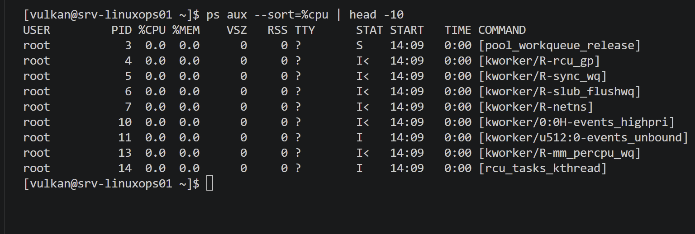
